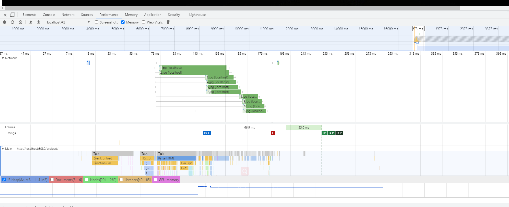

## preload

### 与 `prefetch`的区别

`prefetch`是选择性低优先级获取资源的，它获取的资源更多的是将来的页面而不是当前页面需要的。因此也就规定了它的优先级较低。但是`preload`是强制加载资源的，加载的资源用于当前的页面。

### 为什么引入 `preload`

为了更细粒度的控制资源的加载，我们可以使用`ajax`或者插入标签（`script`、`link`等等）的形式使资源在合适的时间加载。但是有时我们还需要资源在“更早”的时刻加载，但是`ajax`或插入标签的手段不可避免的会带来性能的下降，譬如说引入`script`资源时我们可能并不需要“立即”运行`js`资源，而`ajax`加载资源又可能因为相关代码的执行阻塞而影响到页面性能。所以常用的资源加载手段并不能满足我们**更早**加载资源且**不影响**页面性能的需求，因此`preload`就变得有必要了。

### `preload`用法

##### 使用标记
```HTML
<link rel="preload" href="/styles/other.css" as="style">

<!--使用JS-->
<script>
	var res = document.createElement("link");
	res.rel = "preload";
	res.as = "style";
	res.href = "styles/other.css";
	document.head.appendChild(res);
</script>

```
##### 使用`HTTP HEADER`
```
Link: <https://example.com/other/styles.css>; rel=preload; as=style
```
### `preload`什么时候加载资源

`preload`加载资源的时机如下：

- 浏览器自上而下解析`document`时存在`link`标记，且该标记被指定为 `preload link`
- `preload link` 的 `link` 标签被插入到`document`中
- `link` 标签被指定为 `preload link`，也就是 `rel` 属性更改为 `rel="preload"`
- `preload link` 的 `href` 属性发生了变化
- `crossorigin` 属性发生了变化（修改，添加，删除）
- `as` 属性中的类型由 `user agent` 不支持的类型变为支持的
- `as` 属性的发生变化（修改，添加，删除）
- `type` 属性中的类型发生如 `as` 属性相同的变化
- `media` 属性中的类型发生如 `as` 属性相同的变化

### `preload` 属性

#### `as`属性
```HTML
  <link rel="preload" href="style.css" as="style">

  <link rel="preload" href="main.js" as="script">
```
`as`可以指定资源的类型，它可以允许浏览器
- 依据资源类型更精准地安排资源加载[优先级](https://docs.google.com/document/d/1bCDuq9H1ih9iNjgzyAL0gpwNFiEP4TZS-YLRp_RuMlc/edit#)
- 缓存资源以备重复利用
- 对资源使用正确的[内容安全策略](https://developer.mozilla.org/en-US/docs/Web/HTTP/CSP)
- 设置正确的 `Accept` 请求头

忽略`as`属性或者使用了无效的值，资源加载的效果如同使用 `ajax` 异步加载资源[[1]](https://www.smashingmagazine.com/2016/02/preload-what-is-it-good-for/)，而且浏览器也会采用低优先级的策略加载资源。

可以用`as`指定的资源类型
- `audio` 音频资源，用于 `<audio>`
- `document` 嵌入的`HTML`文件，用于 `<frame>`和`<iframe>`
- `embed` 嵌入的资源，用于 `<embed>`
- `fetch` 用于 `XHR` 或 `fetch` 请求的资源，例如 `ArrayBuffer` 或 `JSON` 文件
- `font` 字体文件
- `image` 图片文件
- `object` 用于`<object>` 引入的资源
- `script` `JS` 文件
- `style` `CSS` 文件
- `track` `WebVTT` 文件
- `worker` `webworker` 文件
- `video` 视频文件，用于 `<video>`

#### `type` 属性

指定资源的`MIME Type` 以便浏览器确定是否支持该类型的资源，如果浏览器支持这一资源那么就会加载该资源，否则就不加载。

#### `crossorigin` 属性

`link` 标签中预加载的资源需要指定这一属性，我们知道这个属性是用来识别加载资源是否跨域的。

#### `media` 属性

`media`属性可以做`media query` 做到响应式加载资源，满足视口条件的资源才会被预加载。

```HTML
 <link rel="preload" href="bg-image-narrow.png" as="image" media="(max-width: 600px)">
 <link rel="preload" href="bg-image-wide.png" as="image" media="(min-width: 601px)">
```

### `preload` 使用过程中发现的问题

`preload` 加载相似的资源时，可能会占用下载线程造成其他资源排队。
有这样的应用场景，假设需要预加载多个图片时，同时页面在渲染中还需要引入图片，那么渲染中引入的图片会因为预加载占用了下载线程而排队。代码如下

```HTML
<!DOCTYPE html>
<html lang="en">
<head>
	<meta charset="UTF-8">
	<meta http-equiv="X-UA-Compatible" content="IE=edge">
	<meta name="viewport" content="width=device-width, initial-scale=1.0">
	<title>Preload</title>
	<link rel="preload" href="./1.jpg" as="image">
	<link rel="preload" href="./2.jpg" as="image">
	<link rel="preload" href="./3.jpg" as="image">
	<link rel="preload" href="./4.jpg" as="image">
	<link rel="preload" href="./5.jpg" as="image">
	<!-- <link rel="preload" href="./6.jpg" as="image"> -->
	<link rel="preload" href="./7.jpg" as="image">
	<link rel="preload" href="./8.jpg" as="image">
	<link rel="preload" href="./9.jpg" as="image">
	<link rel="preload" href="./10.jpg" as="image">
</head>
<body>
	<script>
		var image = new Image();
		image.src = './6.jpg'
		image.onload = function(){
			document.body.appendChild(image)
		}
	</script>
</body>
</html>
```




从性能面板中可以看到后引入的图片`6.png`，是等到有空闲的下载线程后才加载的。因此在使用中要防止 `preload` 滥用导致重要的资源无法优先加载的问题。

### `preload` 一些很酷的用法
利用`onload` 可以创造很多基于标记的异步加载器，譬如我们可以异步加载 `CSS` 文件而又不阻塞页面的`onload` 事件
```HTML
<link rel="preload" as="style" href="./style.css" onload="this.rel='stylesheet'"/>
```
我们也可以异步加载`js`文件，同时又不必像`<script async>` 那样阻塞页面的`onload`。
```HTML
<link rel="preload" as="script" href="./my.js" onload="
	var script=document.createElement('script');
	document.body.appendChild(script);
	script.src=this.href;">
```
>参考
>1. Preload: What Is It Good For? *https://www.smashingmagazine.com/2016/02/preload-what-is-it-good-for/*
>2. Preload Spec *https://w3c.github.io/preload/*
>3. Preload, Prefetch And Priorities in Chrome *https://github.com/xitu/gold-miner/blob/master/TODO/preload-prefetch-and-priorities-in-chrome.md*